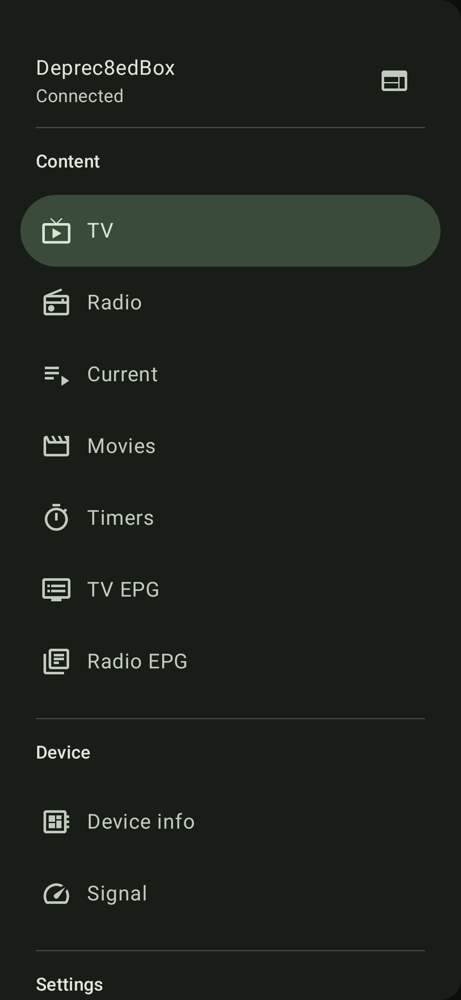
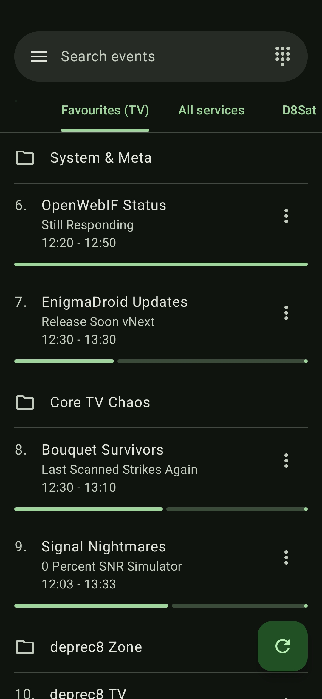
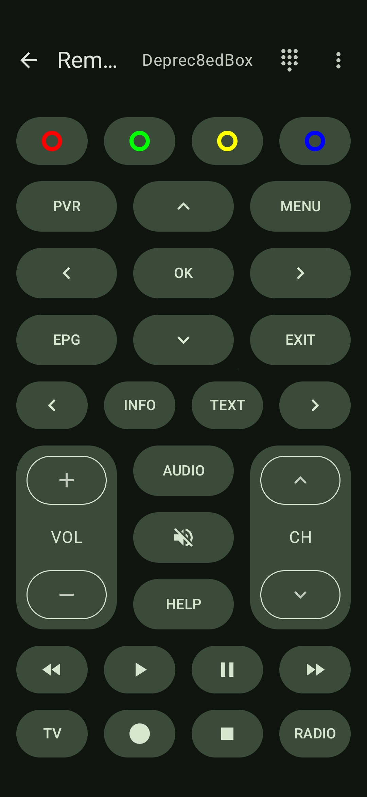
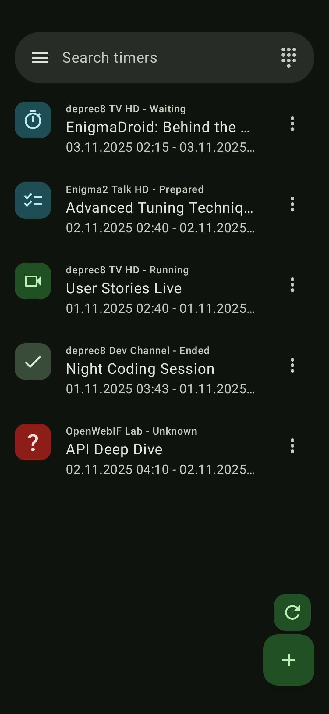
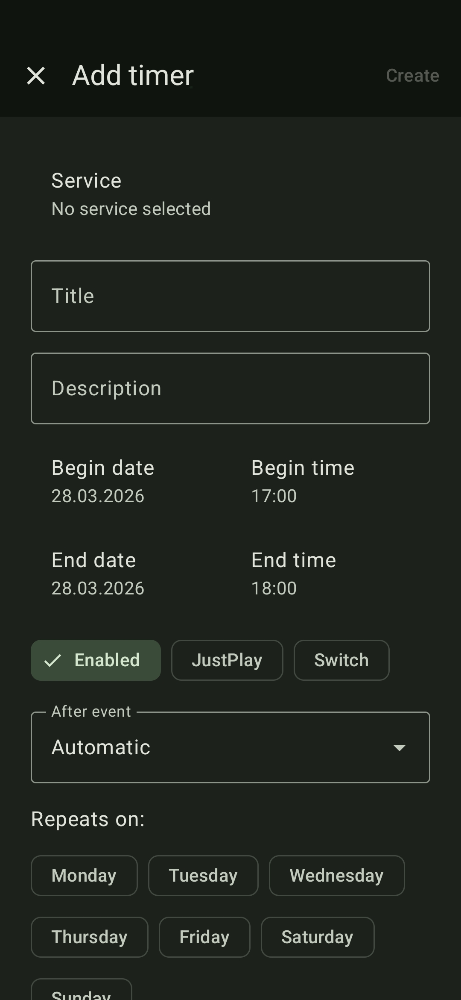
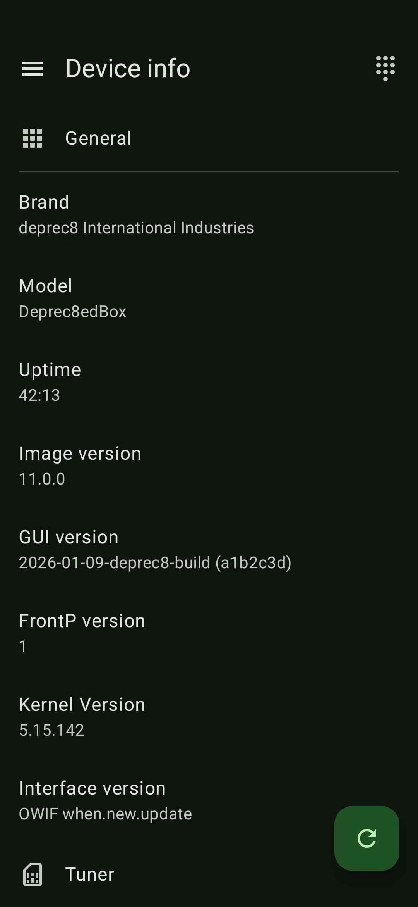

# EnigmaDroid

**EnigmaDroid** is a modern, user-friendly app that lets you control your Enigma2-based satellite or cable set-top box directly from your Android device.

Everywhere in your home, **EnigmaDroid** gives you full access to your receiver’s features and content.

## Installation

## Features

- **Channel & Bouquet List**: Quickly navigate your full channel lineup and favorite bouquets.
- **Timer Management**: Add, remove or edit timers and scheduled recordings.
- **Stream Recordings**: Browse and play your saved shows and movies.
- **EPG Support**: View Electronic Program Guide data with detailed show info for every bouquet.
- **Remote Control**: Full on-screen remote control with keypad.
- **Live TV Streaming**: Watch live broadcasts from your Enigma2 box on your device using a
  compatible video player.
- **Search & Filter**: Find channels or programs with built-in search functionality on every page.
- **Multi-Box Support**: Connect to multiple receivers and switch between them with ease.

## Streaming

**EnigmaDroid** currently uses external media players for streaming live TV and recordings.

[**VLC**](https://www.videolan.org/vlc/download-android.html) is recommended, though other media
players may also work.

## Requirements

- An **Enigma2-based** set-top box (satellite or cable).
- Up-to-date **OpenWebif** plugin enabled and configured.

## Compatibility

Tested with popular Enigma2 images.

Some images, like **VTi**, may require manually updating the OpenWebif plugin to ensure full
compatibility.

## Translation

Translations are managed on [**Crowdin**](https://crowdin.com/project/enigmadroid).

Many translations are generated using machine translation and may need refinement.

Spotted an error? Jump in and fix it directly on Crowdin.

## Screenshots

|  |     |  |
|-------------------------------------------------------------------------------------------------------|------------------------------------------------------------------------------------------------|-----------------------------------------------------------------------------------------------|
|            |    | |
