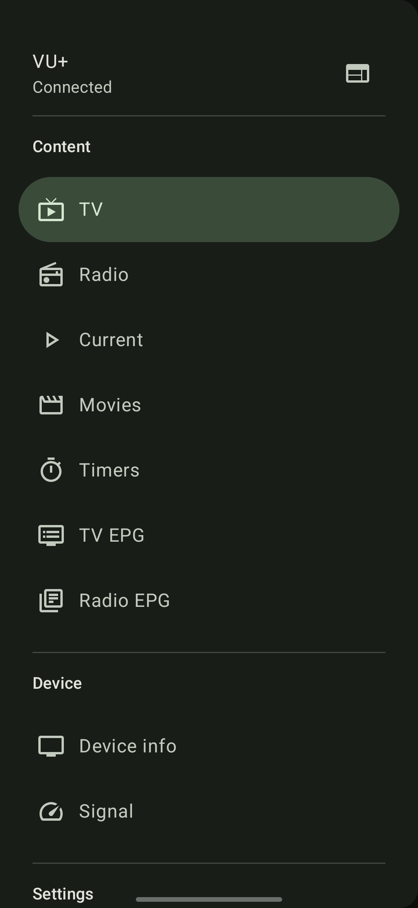
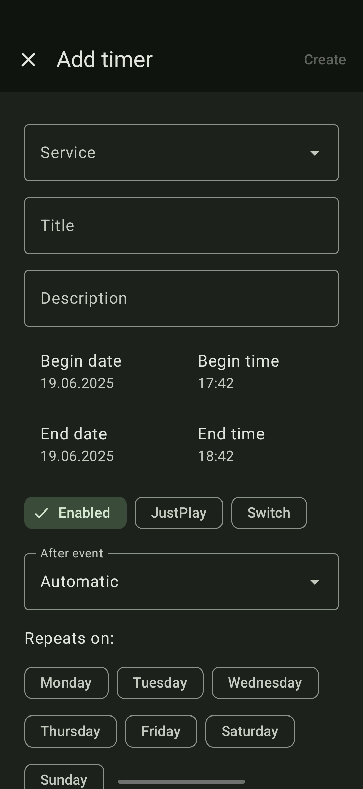
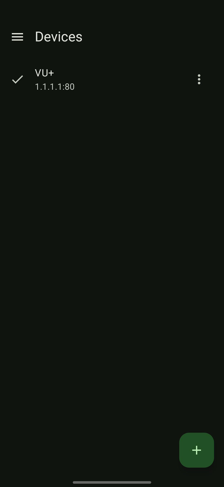

# EnigmaDroid

**EnigmaDroid** is a modern, user-friendly app that lets you control your Enigma2-based satellite or
cable set-top box directly from your Android device. Powered by **OpenWebif**, EnigmaDroid turns
your phone or tablet into a powerful remote control and streaming companion for your TV.

Everywhere in your home, EnigmaDroid gives you full access to your receiver’s features. You can
browse the channel list, zap to your favorite station, manage timers and recordings, or stream live
TV and recordings right to your device.

## Features

- **Live TV Streaming**: Watch live broadcasts from your Enigma2 box on your Android device using a
  compatible video player.
- **Playback Recordings**: Browse and play your saved shows and movies.
- **Channel & Bouquet List**: Quickly navigate your full channel lineup and favorite bouquets.
- **Remote Control**: Full on-screen remote with keypad.
- **Timer Management**: Add, remove or edit timers and scheduled recordings.
- **EPG Support**: View Electronic Program Guide data with detailed show info.
- **Search & Filter**: Find channels or programs with built-in search on every page.
- **Multi-box Support**: Connect to multiple receivers and switch between them.

## Requirements

- A set-top box running **Enigma2**
- **OpenWebif** plugin enabled and configured

## Compatibility

Tested with popular Enigma2 images like **VTi**.

## Installation

## Screenshots

|  |  |     |
| ------------------------------------------------------ | ----------------------------------------------------------------------- | -------------------------------------------------------------------- |
|    | 
