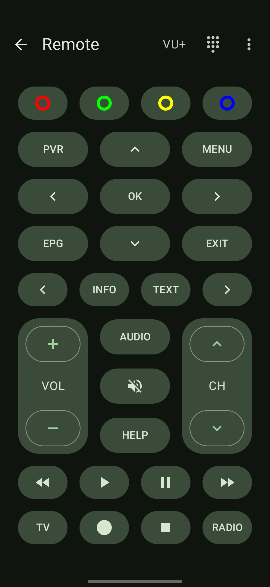
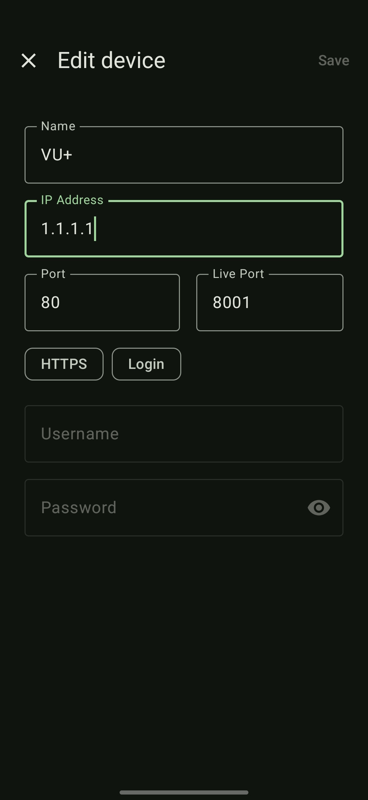

# EnigmaDroid

**EnigmaDroid** is a modern, user-friendly app that lets you control your Enigma2-based satellite or cable set-top box directly from your Android device.

Everywhere in your home, **EnigmaDroid** gives you full access to your receiver’s features and content.

## Installation

## Features

- **Live TV Streaming**: Watch live broadcasts from your Enigma2 box on your device using a compatible video player.
- **Playback Recordings**: Browse and play your saved shows and movies with a compatible video player.
- **Channel & Bouquet List**: Quickly navigate your full channel lineup and favorite bouquets.
- **Remote Control**: Full on-screen remote with keypad.
- **Timer Management**: Add, remove or edit timers and scheduled recordings.
- **EPG Support**: View Electronic Program Guide data with detailed show info.
- **Search & Filter**: Find channels or programs with built-in search on every page.
- **Multi-box Support**: Connect to multiple receivers and switch between them with ease.

## Streaming

EnigmaDroid currently only supports external media players for streaming live content and movies.

[**VLC**](https://www.videolan.org/vlc/download-android.html) is recommended, but other media players can also work.

## Translation

  

Translation is done on [**Crowdin**](https://crowdin.com/project/enigmadroid).

## Requirements

- A set-top box running **Enigma2**
- **OpenWebif** plugin enabled and configured

## Compatibility

Tested with popular Enigma2 images like **VTi**.

## Screenshots

|  |      |  |
|-------------------------------------------------------------------------------------------------------|------------------------------------------------------------------------------------------------|-----------------------------------------------------------------------------------------------|
|            |  |                                                                                               |
